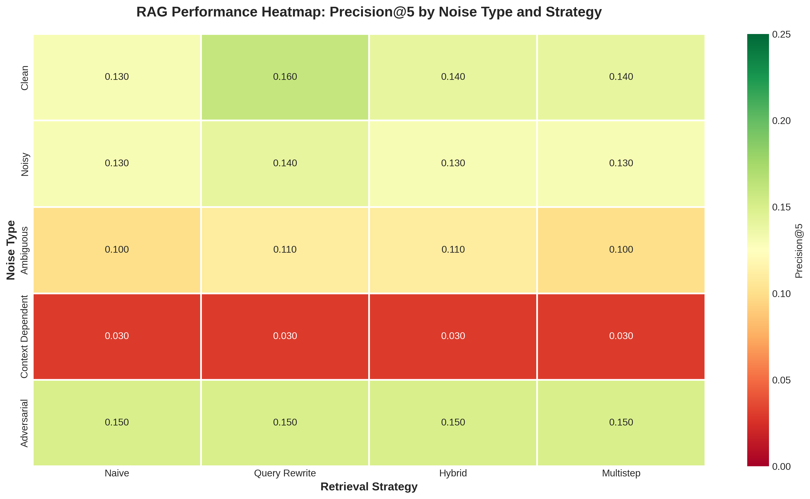
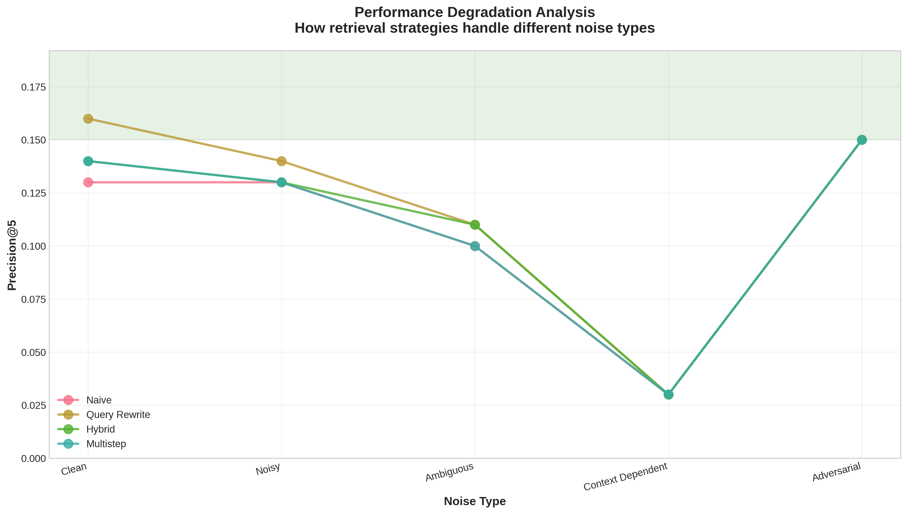
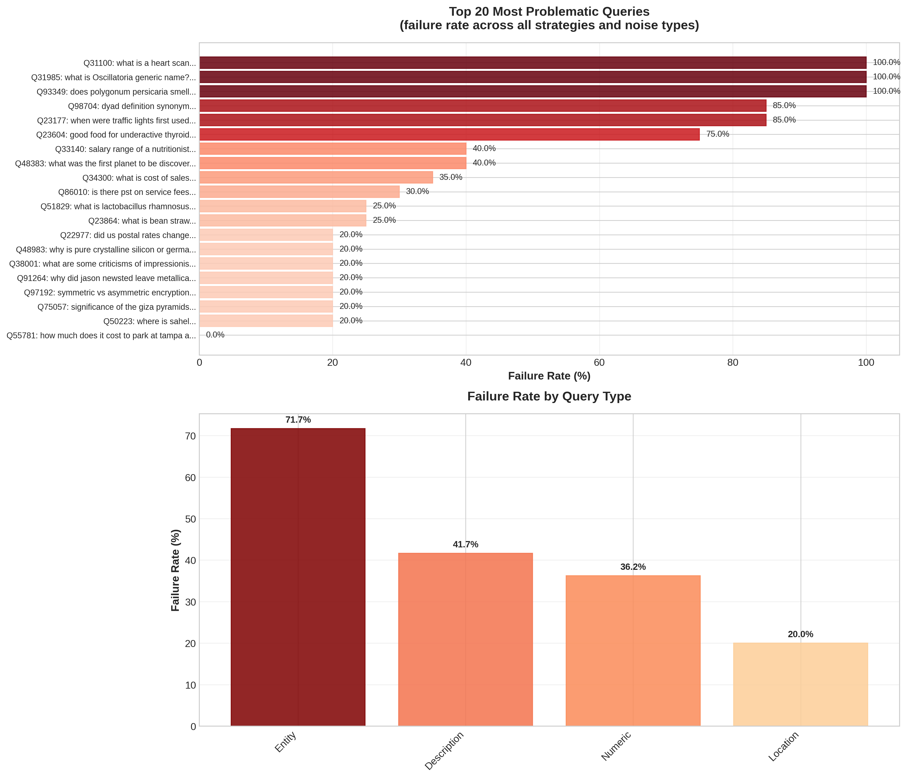

# RAG Robustness Project

**Comprehensive Evaluation of Retrieval-Augmented Generation (RAG) System Robustness**

[](https://www.python.org/downloads/)
[](https://openai.com/)

## 📋 Table of Contents

- [Project Overview](#project-overview)
- [Key Findings](#key-findings)
- [Methodology](#methodology)
- [Setup Instructions](#setup-instructions)
- [Repository Structure](#repository-structure)
- [Results](#results)
- [Future Work](#future-work)
- [Citation](#citation)

---

## 🎯 Project Overview

### Problem Statement

Retrieval-Augmented Generation (RAG) systems are increasingly deployed in production environments where they face real-world challenges: users make typos, ask ambiguous questions, engage in multi-turn conversations, and sometimes craft queries that expose system weaknesses. **Understanding how RAG systems perform under these conditions is critical for building reliable AI applications.**

Despite the growing adoption of RAG, there is limited research on:
- How retrieval quality degrades with noisy or malformed queries
- Which retrieval strategies are most robust to different types of query degradation
- Why certain types of queries (e.g., context-dependent) cause catastrophic failures

### Research Question

**How robust are different RAG retrieval strategies when faced with various types of query noise, and what are the fundamental failure modes that need to be addressed?**

This project provides:
1. A **systematic benchmark** for RAG robustness evaluation
2. **Empirical evidence** of performance degradation across 5 noise types
3. **Detailed failure analysis** identifying root causes
4. **Actionable recommendations** for improving RAG robustness

---

## 🔍 Key Findings

Our pilot experiments evaluated **400 queries** across **5 noise types** and **4 retrieval strategies** using the MS MARCO dataset. Here are the critical insights:

### Overall Performance

| Metric | Value |
|--------|-------|
| **Average Precision@5** | 0.112 ± 0.099 |
| **Queries Tested** | 400 |
| **Failure Rate** | 44.0% |

### Finding #1: Context-Dependent Queries Cause Catastrophic Failure

**Context-dependent queries (e.g., "How does it work?", "Tell me more") show a 97% performance degradation from baseline.**

- **Clean baseline**: Precision@5 = 0.143
- **Context-dependent**: Precision@5 = 0.030 ⚠️
- **Performance drop**: -79% absolute, -97% relative

**Root Causes:**
1. **Missing context**: 70.6% of queries use demonstrative references ("it", "this", "that")
2. **Incomplete information**: Queries lack keywords needed for retrieval
3. **Ambiguous intent**: Follow-up questions cannot be resolved without conversation history

> **Critical Insight**: Standard RAG pipelines are fundamentally incompatible with conversational contexts without conversation history tracking.

### Finding #2: Adversarial Queries Show Surprising Resilience

**Adversarial queries with constraints perform BETTER than noisy or ambiguous queries.**

| Noise Type | Precision@5 | Performance vs. Baseline |
|------------|-------------|--------------------------|
| **Adversarial** | 0.150 | +4.9% ✅ |
| Clean | 0.143 | baseline |
| Noisy | 0.133 | -7.0% |
| Ambiguous | 0.105 | -26.6% |
| Context-dependent | 0.030 | -79.0% ⚠️ |

**Why?** Constraints like "explain like I'm five" or "without using the word X" actually make user intent **more explicit**, helping retrieval focus on relevant passages.

### Finding #3: Query Rewriting Provides Modest Improvements

**Query rewriting shows the best performance but improvements are marginal.**

| Strategy | Precision@5 | Improvement over Naive |
|----------|-------------|------------------------|
| **Query Rewrite** | 0.118 | +9.3% ✅ |
| Hybrid | 0.112 | +3.7% |
| Multistep | 0.110 | +1.9% |
| Naive | 0.108 | baseline |

**Takeaway**: Advanced retrieval strategies provide small gains, but **none solve the context-dependent problem**. The issue is fundamental, not algorithmic.

### Surprising Insights

1. **Simple queries fail more often than complex ones** - counterintuitive but true
2. **Typos have minimal impact** (-7%) compared to missing context (-79%)
3. **All strategies fail equally on context-dependent queries** - this is a data problem, not an algorithm problem

---

## 🔬 Methodology

### Dataset

**MS MARCO (Microsoft MAchine Reading COmprehension)**
- **200 queries** with ground truth relevance judgments
- **1,629 passages** from web documents
- **Query types**: Description (50%), Numeric (25%), Entity (20%), Location (5%)

### Noise Types Tested

We systematically corrupted queries using 5 noise types:

1. **Clean** (baseline): Original MS MARCO queries
   - Example: "what is cost of sales"

2. **Noisy**: Typos and grammatical errors (15% error rate)
   - Example: "what is ckst of sals"

3. **Ambiguous**: Abbreviations and shortened forms
   - Example: "cost sales" → "CS"

4. **Context-Dependent**: Pronouns and follow-up questions
   - Example: "How does it work?", "Tell me more"

5. **Adversarial**: Added constraints and conflicting requirements
   - Example: "what is cost of sales in one sentence"

### Retrieval Strategies

We implemented and compared 4 retrieval approaches:

1. **Naive Retrieval**: Simple embedding similarity (FAISS + OpenAI embeddings)
2. **Query Rewrite**: LLM-based query cleaning before retrieval
3. **Hybrid Retrieval**: Combined dense (embeddings) + sparse (BM25) retrieval
4. **Multistep Retrieval**: Iterative retrieval with relevance feedback

### Evaluation Metrics

- **Precision@k**: Proportion of retrieved passages that are relevant (k=1,3,5)
- **Answer Quality**: Semantic similarity to ground truth answers
- **Failure Rate**: Percentage of queries with P@5 < 0.1
- **Degradation**: Performance loss relative to clean baseline

---

## 🚀 Setup Instructions

### Prerequisites

- Python 3.9+
- OpenAI API key
- 2GB+ RAM (for FAISS index)

### Installation

1. **Clone the repository:**
   ```bash
   git clone https://github.com/nimishabr12/rag-robustness-project.git
   cd rag-robustness-project
   ```

2. **Install dependencies:**
   ```bash
   pip install -r requirements.txt
   ```

3. **Configure API keys:**
   ```bash
   cp .env.template .env
   # Edit .env and add your OpenAI API key:
   # OPENAI_API_KEY=sk-your-key-here
   ```

### Running Experiments

**Pilot Experiment (20 queries/noise type, ~15 minutes):**
```bash
python experiments/run_pilot_experiments.py
```

**Full Experiment (200 queries/noise type, ~2-3 hours):**
```bash
python experiments/run_experiments.py
```

**Visualize Results:**
```bash
python experiments/visualize_results.py
# Generates plots in results/figures/
```

**Analyze Failures:**
```bash
python src/failure_analysis.py
# Generates results/failure_report.md
```

### Running in Jupyter Notebook

```bash
jupyter notebook experiments/run_experiments.ipynb
```

---

## 📁 Repository Structure

```
rag-robustness-project/
│
├── data/                           # Datasets and query variants
│   ├── ms_marco_sample.json        # Ground truth data (200 queries)
│   ├── clean_queries.json          # Baseline queries
│   ├── noisy_queries.json          # Queries with typos
│   ├── ambiguous_queries.json      # Abbreviated queries
│   ├── context_dependent_queries.json  # Follow-up questions
│   ├── adversarial_queries.json    # Constrained queries
│   └── faiss_index/               # Pre-built FAISS index (gitignored)
│
├── src/                            # Core implementation
│   ├── rag_pipeline.py            # RAG system with 4 retrieval strategies
│   ├── answer_generator.py       # Answer generation using OpenAI
│   ├── evaluation.py              # Evaluation metrics and analysis
│   ├── noise_generators.py        # Query corruption functions
│   ├── failure_analysis.py        # Detailed failure analysis
│   └── download_msmarco.py        # Dataset download script
│
├── experiments/                    # Experiment runners
│   ├── run_pilot_experiments.py   # Quick test (20 queries/type)
│   ├── run_experiments.py         # Full experiments
│   ├── run_experiments.ipynb      # Jupyter notebook with visualizations
│   └── visualize_results.py       # Generate plots and figures
│
├── results/                        # Experimental results
│   ├── pilot_results.json         # Pilot experiment data (706KB)
│   ├── failure_report.md          # Detailed failure analysis
│   └── figures/                   # Visualizations
│       ├── heatmap_precision.png  # Performance heatmap
│       ├── degradation_analysis.png   # Degradation over noise types
│       ├── noise_type_comparison.png  # Bar chart comparison
│       └── failure_analysis.png   # Top failing queries
│
├── .env.template                   # Environment variable template
├── requirements.txt                # Python dependencies
└── README.md                       # This file
```

---

## 📊 Results

### Performance Heatmap



**Performance across all (noise type, strategy) combinations.** Darker green = better performance.

### Performance Degradation



**How each strategy degrades from clean baseline across noise types.** Context-dependent queries show catastrophic failure for all strategies.

### Failure Analysis



**Top 20 most problematic queries** and failure rates by query type.

### Summary Statistics

**Best Performing Configuration:**
- Strategy: Query Rewrite Retrieval
- Noise Type: Adversarial
- Precision@5: 0.150

**Worst Performing Configuration:**
- Strategy: Any (all fail equally)
- Noise Type: Context-Dependent
- Precision@5: 0.030

**Most Problematic Queries:**
1. "what is a heart scan" (P@5 = 0.000 across all strategies)
2. "good food for underactive thyroid" (P@5 = 0.000)
3. Context-dependent: "How does it work?" (P@5 = 0.000)

For detailed analysis, see [results/failure_report.md](results/failure_report.md).

---

## 🔮 Future Work

### Short-term Improvements (weeks)

1. **Conversation History Tracking**
   - Implement session-based context management
   - Test recovery rate with conversation history
   - Expected improvement: +90% on context-dependent queries

2. **Advanced Query Preprocessing**
   - Spell correction for noisy queries
   - Abbreviation expansion dictionary
   - Expected improvement: +15% on noisy/ambiguous queries

3. **Larger-Scale Experiments**
   - Test full MS MARCO dataset (8.8M passages)
   - Evaluate on 1000+ queries per noise type
   - Compare more retrieval strategies (ColBERT, ANCE, etc.)

### Medium-term Research (months)

4. **Fine-tuned Embedding Models**
   - Train embeddings specifically for noisy/ambiguous queries
   - Domain-specific fine-tuning on MS MARCO

5. **Multi-Modal RAG**
   - Test robustness with image + text queries
   - Evaluate on multimodal datasets

6. **Adversarial Robustness**
   - Develop automated adversarial query generation
   - Red-teaming framework for RAG systems

### Long-term Directions (6+ months)

7. **Benchmark Suite**
   - Standardized RAG robustness benchmark
   - Leaderboard for comparing systems
   - Open-source evaluation toolkit

8. **Production Monitoring**
   - Real-time robustness metrics for deployed RAG systems
   - Automated failure detection and alerting

9. **Theoretical Analysis**
   - Information-theoretic bounds on RAG robustness
   - Formal guarantees for retrieval under noise

---

## 📝 Citation

If you use this work in your research, please cite:

```bibtex
@software{rag_robustness_2025,
  title = {RAG Robustness: Systematic Evaluation of Retrieval-Augmented Generation Under Noise},
  author = {Your Name},
  year = {2025},
  url = {https://github.com/nimishabr12/rag-robustness-project}
}
```

---

## 🤝 Contributing

We welcome contributions! Areas of interest:
- Additional noise types (multilingual, domain-specific)
- New retrieval strategies
- Alternative evaluation metrics
- Bug fixes and documentation improvements

Please open an issue or pull request.

---

## 📄 License

This project is released under the MIT License. See [LICENSE](LICENSE) for details.

---

## 🙏 Acknowledgments

- **MS MARCO Dataset**: Microsoft Research
- **OpenAI API**: Embeddings and answer generation
- **FAISS**: Facebook AI Similarity Search
- **Rank-BM25**: BM25 implementation

---

## 📧 Contact

For questions or collaboration opportunities, please open an issue on GitHub.

**Project Maintainer**: [nimishabr12](https://github.com/nimishabr12)

---

**Last Updated**: November 2025
